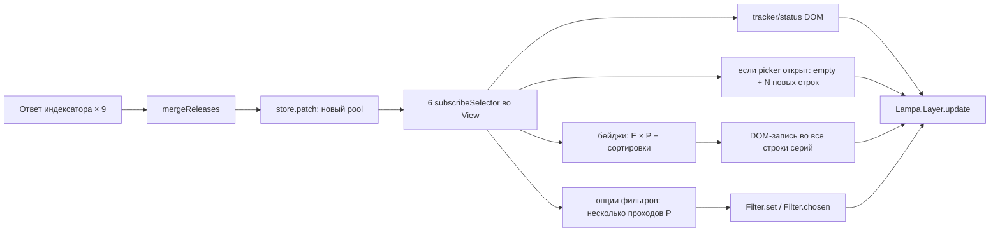
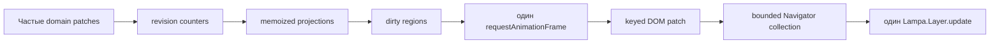

# Torrent Mod: системный дизайн оптимизации рендера

Статус: кодовая часть шагов 0–7 реализована и **подтверждена замерами** — проекции мемоизированы,
девять патчей за кадр дают один визуальный коммит, неизменившаяся проекция не производит ни одной
DOM-мутации. Scoring не мутирует пул, state использует монотонные ревизии, основной список и picker
обновляются keyed, а штатный `Navigator` Lampa получает ограниченную коллекцию.

**Узкое место после этих шагов сместилось и больше не находится в рендере.** Весь доменный слой
стоит около 1.3 мс на ревизию пула, тогда как один ответ трекера — 10–24 мс одной неразрываемой
задачей. Разбор и обоснование — в разделе [«Вторая волна: intake, а не рендер»](#вторая-волна-intake-а-не-рендер),
он же задаёт текущий план работ. Регрессии на всё перечисленное ловит
[`test/performance.test.mjs`](../../Plugins/TorrentModPlugin/test/performance.test.mjs) в общем прогоне
`npm run test:plugin`.

Осталась живая проверка бюджетов на WebOS. Worker и настоящее DOM-windowing остаются условными
следующими шагами только при подтверждённых long tasks. Документ не предлагает переписывать экран на
новый UI-фреймворк и не меняет поисковую семантику или навигационный контракт Lampa.

Связанные документы:

- [доменная архитектура](torrent-mod-domain-architecture.md);
- [параллельный поиск](torrent-mod-parallel-search.md);
- [единый пул раздач](torrent-mod-unified-pool.md);
- [навигационный контракт Lampa](lampa-navigation-contract.md).

## Цель

Экран должен оставаться отзывчивым, пока девять индексаторов почти одновременно добавляют сотни раздач,
а открытие picker не должно зависеть от полного размера списка. Требуется уменьшить одновременно три вида
работы:

1. повторные доменные вычисления над одним и тем же пулом;
2. количество и размер DOM-изменений;
3. число смонтированных строк, которые пользователь не видит.

Главный принцип: **поисковое состояние может обновляться часто, визуальный слой — не обязан коммитить каждое
промежуточное состояние отдельно**.

## Репрезентативный сценарий и живой baseline

Замер выполнен 11 августа 2026 года в открытом Chrome-экране Torrent Mod для «Теории большого взрыва»:

`/app/?card=1418&media=tv&source=cub`

Это хороший стрессовый сценарий: 12 сезонов, 279 серий, много релизов на обычных трекерах. Важно: все 279
серий одновременно **не рендерятся**. Экран держит только серии выбранного сезона, поэтому оптимизировать
«279 строк» как исходную проблему не нужно.

| Метрика | Фактическое значение |
|---|---:|
| Индексаторов | 9 |
| Раздач в итоговом доменном пуле | 211 |
| Серий в выбранном сезоне / строк в DOM | 17 / 17 |
| Высота строки серии | 98 px |
| Потомков внутри одной строки серии | 10 |
| Кандидатов для первой серии в picker | 39 |
| Одновременно попадает в viewport picker | 8 |
| Высота строки picker | 86 px |
| Потомков внутри одной строки picker | 3 |
| Элементов Torrent Mod в DOM | 264 |
| Всего элементов страницы | 1056–1057 |
| Строк picker после закрытия | 39, остаются смонтированными |
| Сообщений Torrent Mod за секунду поиска | 273 |
| Из них `metadata-parse` | 215 |

Ответы индексаторов добавили соответственно `10 + 13 + 0 + 8 + 8 + 0 + 49 + 48 + 75 = 211`
раздач. Они пришли в одну секунду. После каждого ответа `episodes-interactor.js` создаёт новый `pool` и
делает `store.patch()`. Суммарный размер пулов, которые последовательно увидел UI:

`10 + 23 + 23 + 31 + 39 + 39 + 88 + 136 + 211 = 600`.

Для 17 серий текущий `selectEpisodeBadges()` вызывает `evaluateCandidatePool()` отдельно для каждой серии.
Получается около `600 × 17 = 10 200` оценок кандидатов за один поисковый burst, плюс повторная фильтрация и
до 17 сортировок на каждый из девяти промежуточных пулов. Финальный patch сам по себе даёт `211 × 17 =
3 587` оценок.

### Что измерение меняет в приоритетах

- Виртуализация серий не является первым шагом: 17–24 строки для обычного сезона приемлемы.
- Главная CPU-проблема находится до DOM — в повторном построении derived state.
- Главная DOM-проблема находится в picker: 39 строк смонтированы ради 8 видимых; после закрытия они остаются
  вместе с обработчиками событий.
- Подробная диагностика полезна, но 273 вызова консоли за один burst и создание сотен объектов искажает
  профилирование и занимает main thread.

## Аудит первой реализации virtual scroll

Первая реализация DOM-windowing удалена после проверки с исходниками Lampa. Она нарушала сразу несколько
контрактов платформы:

- размер viewport измерялся до показа overlay и часто заменялся условными `600px`;
- шаг строки был жёстко задан как `86px`, хотя Lampa масштабирует `em`, а margin не входит в `offsetHeight`;
- замена spacer-окна происходила поверх сохранённого transform штатного `Lampa.Scroll`;
- переход через границу окна пересоздавал строки и сбрасывал spatial collection;
- каждый промежуточный результат трекера повторно вызывал `Controller.toggle()`, возвращая фокус к началу.

Для фактических 30–100 раздач выбран используемый самой Lampa паттерн: стабильный keyed DOM и ограниченная
коллекция `Navigator` вокруг текущего элемента. При обновлении списка сохраняются identity, экранная позиция
фокуса и transform `Lampa.Scroll`. Корректность переходов проверяется на настоящем
`vender/navigator/navigator.js` из установленной Lampa. DOM-windowing можно вернуть только для списков в
сотни элементов и после отдельного контракта с `Scroll.shift()`; текущий picker в нём не нуждается.

## Исходный цикл обновления до оптимизации



Ключевые места:

- [`domain/store.js`](../../Plugins/TorrentModPlugin/domain/store.js) уведомляет подписчиков синхронно на
  каждый `patch`;
- [`domain/results-selectors.js`](../../Plugins/TorrentModPlugin/domain/results-selectors.js)
  пересчитывает кандидатов для каждой серии;
- [`search/rank/scoring.js`](../../Plugins/TorrentModPlugin/search/rank/scoring.js) фильтровал, оценивал и сортировал
  кандидатов, одновременно записывая `_score` в исходный item;
- [`ui/results-screen.js`](../../Plugins/TorrentModPlugin/ui/results-screen.js) пишет все бейджи независимо
  от изменения текста, повторно вызывает `Filter.set`, перестраивает picker через `empty()` и делает
  несколько независимых `Lampa.Layer.update()`;
- [`ui/results-screen.js`](../../Plugins/TorrentModPlugin/ui/results-screen.js) скрывает picker через
  `display:none`, но не освобождает его строки до следующей перестройки или уничтожения экрана.

## Целевая архитектура



Архитектура состоит из четырёх независимых слоёв:

1. **Domain state** продолжает принимать каждый сетевой результат без задержки.
2. **Projection layer** строит стабильные view model и кэширует их по ревизиям данных.
3. **Render scheduler** объединяет изменения областей экрана до ближайшего кадра.
4. **Renderers** применяют только отличающиеся поля; длинные списки используют ограниченное окно DOM.

Сетевой код не должен знать о кадрах браузера, а доменный store не должен терять синхронную семантику ради
UI-оптимизации.

## Шаг 0. Инструментирование до изменений

### Реализация

Добавить `shared/core/perf-metrics.js`, включаемый настройкой `torrent_mod_perf_diagnostics`.

Метрики:

- `pool-patch-to-render`;
- `episode-projection`;
- `picker-projection`;
- `filter-projection`;
- `dom-commit` по каждой области;
- `layer-update`;
- число созданных, обновлённых и удалённых строк;
- число смонтированных строк и элементов Torrent Mod;
- число long task длительностью от 50 ms при наличии API.

Использовать `performance.mark()/measure()` и feature-detected `PerformanceObserver`. Наблюдение за DOM через
`MutationObserver` разрешено только в диагностическом режиме: постоянно включённый observer сам влияет на
измеряемый экран.

### Контракт диагностики

- обычный режим: один итоговый объект метрик на поисковую сессию;
- подробный режим: bounded ring buffer на 500 записей;
- `window.TorrentModDiagnostics.snapshot()` возвращает копию буфера для анализа;
- никакие метрики не входят в доменный state и не запускают render.

### Definition of done

- можно воспроизвести baseline из этого документа без DevTools Performance panel;
- выключенная диагностика добавляет не более одной дешёвой проверки флага на измеряемый участок;
- все последующие этапы сравниваются с одним и тем же сценарием: 250 раздач, 24 серии, 9 ответов.

Реализовано в `shared/core/perf-metrics.js`. Включение доступно через настройку
«Диагностика производительности» или до открытия экрана через
`TorrentModDiagnostics.performance = true`. Последние 20 итоговых сессий возвращает
`TorrentModDiagnostics.performanceSnapshot()`; наблюдатели и marks существуют только при включённом режиме.

## Шаг 1. Сделать scoring чистым и ввести ревизии

### Проблема

`evaluateCandidatePool()` пишет `item._score`. Один item последовательно оценивается для разных серий, поэтому
его содержимое зависит от последнего вызова. Это мешает memoization и делает object identity ненадёжной.

### Реализация

1. Возвращать `{ item, score }`, не изменяя item.
2. Добавить в state монотонные счётчики:
   - `poolRevision` — меняется только при содержательном изменении пула;
   - `episodesRevision` — при смене списка серий;
   - `filtersRevision` — при изменении фильтров;
   - `defaultsRevision` — при изменении сохранённой раздачи сезона.
3. `mergeReleases()` должен сохранять старую ссылку на массив, если ни одна запись не добавлена и ни одна
   характеристика выбранного представителя не улучшилась.
4. Не использовать глубокое сравнение всего пула: стабильные release identity и ревизии дешевле и
   предсказуемее.

### Definition of done

- повторная оценка другого эпизода не меняет объекты пула;
- бессодержательный ответ индексатора не меняет `poolRevision`;
- существующие результаты ranking и порядок кандидатов совпадают со snapshot-тестами.

## Шаг 2. Перейти от универсальных селекторов к memoized projections

Создать `domain/results-projections.js`. Он не хранит UI-узлы и остаётся чистым доменным модулем.

### Проекция списка серий

`selectEpisodeRowsProjection(state, object, savedDefault)` возвращает:

```js
{
    key: "poolRevision/episodesRevision/filtersRevision/defaultsRevision",
    rows: {
        1: { badgeText, loading, canPick, candidateCount, bestIdentity },
        2: { badgeText, loading, canPick, candidateCount, bestIdentity }
    }
}
```

Внутри одного вызова:

1. state-фильтры применяются к пулу один раз;
2. общие оценки payload, availability и качества вычисляются один раз на item там, где они не зависят от
   эпизода;
3. для каждого эпизода считаются только episode-dependent match и итоговая надбавка;
4. для бейджа не строится и не сортируется полный массив: достаточно `candidateCount`, лучшего кандидата и
   сохранённого кандидата;
5. полный отсортированный список строится лениво только для открытого picker.

Это сохраняет простую первую реализацию `P × E`, но убирает повторные фильтры, создание массивов и `E`
сортировок. После замеров можно добавить индекс покрытия:

- `bySeason[season]`;
- `unknownSeason`;
- `singleEpisode[season][episode]`;
- `ranges[season]` для паков.

Индекс нельзя вводить первым: форматы `S1-12`, абсолютная нумерация аниме и релизы без явного сезона должны
сначала получить отдельный набор contract-тестов. Ошибка индекса опаснее выигранных миллисекунд.

### Проекция фильтров

`selectFilterProjection()` кэшируется по `poolRevision + filtersRevision + season`. `Filter.set()` вызывается
только если изменилась структурная сигнатура options, а `Filter.chosen()` — если изменились выбранные labels.

### Проекция picker

`selectPickerProjection()` зависит только от активного эпизода и тех же ревизий. Результат содержит stable
identity, готовый текст и selected state, чтобы View не вызывал scoring и форматтеры на каждой строке.

### Кэш

Для экрана достаточно last-value cache, а не unbounded `Map`: пользователь одновременно видит один сезон,
один набор фильтров и один picker. Кэш очищается через lifecycle scope экрана.

### Definition of done

- unrelated patch (`poolIndexers`, status timer) возвращает ту же ссылку projection;
- один `poolRevision` вызывает не более одного расчёта episode projection;
- picker projection не строится, пока picker закрыт;
- один projection выполняет не более `P × E` episode-dependent оценок, применяет state-фильтры один раз и
  не сортирует полный список ради каждого бейджа; общее сокращение вызовов во время burst фиксируется после
  подключения scheduler на следующем шаге.

## Шаг 3. Один render commit на кадр

Добавить `ui/render-scheduler.js` с dirty regions:

```text
content | episodeBadges | filters | status | trackers | picker
```

Каждая подписка только:

1. запоминает последнюю projection;
2. помечает область dirty;
3. планирует один `requestAnimationFrame`, если он ещё не запланирован.

Во время flush области коммитятся в фиксированном порядке: structural content → rows → filters/status/trackers
→ picker → один `Lampa.Layer.update()`.

`requestAnimationFrame()` выбран вместо microtask и `setTimeout(0)`: microtask может обработать все девять
сетевых ответов до возможности браузера нарисовать кадр, а rAF синхронизирует DOM-записи с repaint. Для
WebOS предусмотреть fallback на `setTimeout(flush, 16)`.

Store остаётся синхронным. Это важно для `selection-interactor.js`, generation guards и тестов: меняется
только частота визуальных коммитов, не доменная последовательность состояний.

### `Lampa.Layer.update()`

Сейчас он вызывается из `refreshGrid`, `setStatus`, tracker animations и tracker render. Ввести
`requestLayerUpdate()` как часть scheduler. В пределах кадра реальный `Lampa.Layer.update()` вызывается не
более одного раза.

Таймер исчезновения tracker может удалить DOM сам, но после удаления тоже вызывает только
`requestLayerUpdate()`.

### Definition of done

- девять синхронных/почти синхронных tracker patches дают один-два визуальных commit, а не девять;
- `Lampa.Layer.update()` вызывается максимум один раз за animation frame;
- промежуточные данные не теряются: финальный projection соответствует последнему state;
- закрытие экрана отменяет назначенный rAF через lifecycle.

## Шаг 4. Keyed patch вместо полной перестройки

### Серии

Строки создаются один раз на `episodesRevision`, ключ — номер серии. Изменение пула обновляет только:

- badge text;
- loading/shimmer;
- `canPick`/шеврон;
- выбранный или просмотренный state, если он изменился.

Перед записью сравнивать новый row view model с сохранённым. Не вызывать `.text()`, `.html()` и
`.toggleClass()`, если значение совпало.

### Picker и основной список кандидатов

Ключ — `releaseIdentity`. Renderer должен:

1. построить новые узлы в detached `DocumentFragment`;
2. одним commit заменить содержимое при структурном изменении;
3. при изменении только seeders/selected state обновить соответствующие keyed nodes;
4. сохранить focused identity и восстановить фокус после reorder;
5. не вызывать повторно `Lampa.Controller.add()` при каждом обновлении открытого picker.

### Lifecycle

Использовать вложенные scope:

```text
screenScope
├── seasonRenderScope
└── pickerScope (создаётся на open, dispose на close)
```

Закрытие picker освобождает его DOM, timers и row handlers. Повторное открытие использует memoized picker
projection и строит актуальную keyed-коллекцию.

### Почему keyed renderer обязателен

Keyed renderer отделяет correctness навигации и сохранения фокуса от обновления ranking. Изменение seeders
не пересоздаёт строку, а изменение порядка перемещает существующий узел с сохранением identity.

### Definition of done

- одинаковая projection создаёт ноль DOM mutations;
- добавление одной раздачи не пересоздаёт неизменившиеся строки;
- закрытый picker содержит ноль `.torrent-mod-picker-item`;
- фокус и selected release сохраняются после изменения seeders и reorder.

## Шаг 5. Ограниченная коллекция Navigator

Picker сохраняет все keyed-строки в DOM, но передаёт штатному spatial `Navigator` только элементы в радиусе
36 позиций от текущего фокуса. Для обычного списка до 72 строк используется вся коллекция. Это повторяет
паттерн `limit_collection` из самой Lampa и не вмешивается в transform `Lampa.Scroll`.

При движении внутри коллекции работают обычные `Navigator.canmove()/move()`. На границе выбирается соседняя
identity, коллекция перестраивается вокруг неё и фокус продолжается без пропуска. При обновлении ranking:

1. строки обновляются keyed по `releaseIdentity`;
2. если порядок не изменился, DOM не переставляется;
3. если порядок изменился, запоминается экранная координата focused row;
4. после перестановки вызываются `Navigator.setCollection()` и `Navigator.focused()`;
5. `Lampa.Scroll.shift()` компенсирует изменение координаты, поэтому экран не прыгает.

DOM-windowing со spacer-элементами для текущего масштаба данных не используется. Его цена — собственная
модель высот, синхронизация transform и сложный lifecycle фокуса — выше стоимости 30–100 простых строк.

### Definition of done

- 198 последовательных переходов вниз и вверх через bounded collection проходят на реальном коде
  `vender/navigator/navigator.js`;
- приход результатов трекера не вызывает повторный `Controller.toggle()`;
- неизменный порядок создаёт ноль структурных DOM mutations;
- reorder сохраняет focused identity и её экранную позицию;
- закрытый picker содержит ноль `.torrent-mod-picker-item`.

## Шаг 6. Снизить частоту поисковых и диагностических событий

### Progressive search

Ответ каждого индексатора перед parsing/gates переносится в отдельную macrotask. Завершение progressive
search ждёт все отложенные обработки, поэтому финальный state не обгоняет результаты. Render scheduler
объединяет patches, пришедшие до одного кадра.

Не добавлять debounce в `PluginHub`: сервер должен продолжать отдавать результаты независимо от частоты
рендера клиента.

### Логирование

Текущий baseline создаёт 215 отдельных `metadata-parse` сообщений и 273 сообщения Torrent Mod за секунду.
Сохранить диагностическую полноту, изменив форму доставки:

- обычный режим: одна summary-запись только если индексатор действительно что-то отфильтровал;
- summary содержит общие counts, причины и до 100 rejected titles;
- отдельная запись metadata каждой раздачи доступна только при
  `window.TorrentModDiagnostics.verbose = true`;
- ошибки parsing остаются предупреждениями независимо от verbose-режима;
- диагностический обход всего пула по всем сериям удалён: он повторял scoring исключительно ради console.

Это не удаляет нужные для отладки данные, но console transport перестаёт быть частью горячего пути обычного
экрана.

### Optional worker

Web Worker для parsing/scoring рассматривать только если после шагов 1–6 WebOS всё ещё показывает long task
от 50 ms. До этого worker добавит сериализацию 200 объектов, второй протокол отмены и сложность сборки, не
решая DOM-проблему.

## Шаг 7. Тестовая стратегия

### Unit/contract tests

1. Scoring не мутирует item.
2. Memoized selector возвращает ту же ссылку на unrelated patch.
3. Изменение `poolRevision` инвалидирует только зависящие projections.
4. Episode projection совпадает с текущим `evaluateCandidatePool()` на существующих fixtures.
5. Bounded Navigator collection корректна для `0, 1, 39, 100, 250` элементов.
6. Reorder сохраняет focused identity.
7. Удаление focused item выбирает ближайшего соседа.
8. Dispose scope отменяет rAF и удаляет DOM/listeners.

### Operation-count benchmark

Wall-clock Node-тест нестабилен, поэтому обязательный regression test считает операции. Реализован как
[`test/performance.test.mjs`](../../Plugins/TorrentModPlugin/test/performance.test.mjs) — состав
счётчиков, бюджеты и проверка чувствительности описаны в разделе
[«Регрессионный тест производительности»](#регрессионный-тест-производительности). Исходно
запланированный минимум покрыт: 24 серии, 9 последовательных pool revisions, не более одного расчёта
проекции на revision, не более одного DOM commit на симулированный кадр. Пул взят больше плана
(720 вместо 250) — ограничение на 73 элемента в spatial collection проверяется отдельно, в
[`lampa-navigation.test.mjs`](../../Plugins/TorrentModPlugin/test/lampa-navigation.test.mjs) на живом
коде `Navigator`.

### Browser/WebOS acceptance

Сценарии:

- «Теория большого взрыва», сезон 1;
- сезон с 24 сериями;
- picker на 39 и синтетически на 250 кандидатов;
- открытый picker во время прихода tracker results;
- смена фильтра, меняющая ranking и количество кандидатов;
- быстрое переключение сезона и немедленный Back.

Начальные бюджеты:

| Метрика | Desktop Chrome | Целевой WebOS |
|---|---:|---:|
| Открытие готового picker, p95 | ≤ 50 ms | ≤ 100 ms |
| DOM commit одного поискового burst | ≤ 16 ms | ≤ 32 ms |
| Long tasks ≥ 50 ms во время burst | 0 | 0 |
| Задержка прогрессивного результата | ≤ 50 ms | ≤ 100 ms |
| `Lampa.Layer.update` | ≤ 1 на кадр | ≤ 1 на кадр |
| Элементов в Navigator при N > 72 | ≤ 73 | ≤ 73 |

Бюджеты WebOS уточняются после первого замера на телевизоре, но не ослабляются без записи фактического
профиля и причины.

## Шаг 8. Порядок поставки

Каждый этап — отдельный проверяемый commit:

1. instrumentation и baseline fixture;
2. pure scoring + revisions;
3. memoized projections;
4. rAF render scheduler + единый `Layer.update`;
5. keyed episode rows и filter/status diff;
6. keyed picker + picker lifecycle scope;
7. bounded Navigator collection на реальном коде Lampa;
8. WebOS проверка фокуса, reorder и `Scroll.shift()`;
9. свёртка verbose search logs в diagnostics buffer.

Кодовые этапы 0–7 и 9 закрыты в `0.1.4`. Diagnostics хранит до 500 verbose-записей в
`window.TorrentModDiagnostics.entries`; `snapshot()` возвращает копию, `clear()` очищает буфер, а
`consoleOutput = true` при необходимости дублирует verbose-записи в console. Этап 8 остаётся ручным
acceptance-прогоном на телевизоре: unit-тест не может воспроизвести WebOS layout/paint и поведение его
версии Chromium.

Desktop Chrome acceptance на `0.1.3` подтвердил: 17 строк серий, 39 строк открытого picker, 264 элемента
Torrent Mod и 1068 элементов страницы. После закрытия picker число его строк сразу становится нулём, а
страница возвращается к 913 элементам. Ошибок Torrent Mod при открытии, навигации и закрытии не зафиксировано.

На каждом commit сравниваются identity/order кандидатов и навигационные contract-тесты. Нельзя совмещать
переписывание scoring, scheduler и навигации в один большой change set: при регрессии будет
невозможно отделить ошибку данных от ошибки DOM/focus.

## Вторая волна: intake, а не рендер

Шаги 0–7 решали задачу «слишком много DOM-коммитов и повторных доменных вычислений». Задача решена.
Повторный замер по тому же сценарию показал, что оставшийся бюджет main thread уходит в другое место —
в разбор ответов трекеров, который к UI-слою отношения не имеет, но именно он и морозит интерфейс.

### Замер

Прогон на реальных модулях: пул 211 раздач, 17 серий, 12 сезонов, заголовки из
[`test/fixtures/live-multitracker.json`](../../Plugins/TorrentModPlugin/test/fixtures/live-multitracker.json).
Колонка WebOS — оценка по множителю ×10 к desktop V8, её ещё предстоит подтвердить на телевизоре
(это тот же незакрытый шаг 8).

| Участок | Desktop Node | Оценка WebOS |
|---|---:|---:|
| `selectEpisodeBadges` (17 × 211) | 0.54 мс | ~5 мс |
| `selectPickerData` | 0.62 мс | ~6 мс |
| `buildFilterItems` | 0.12 мс | ~1 мс |
| `runSearchGates`, батч 211 сырых записей | **9.7 мс** | **~97 мс** |
| `runSearchGates`, батч 600 сырых записей | **24.0 мс** | **~240 мс** |
| └ из них `parseRelease` | 14.5 мс (60 %) | ~145 мс |

Соотношение важнее абсолютных чисел и от множителя не зависит: **доменные проекции дешевле разбора
одного ответа трекера на порядок**. При девяти трекерах и двух-четырёх запросах плана таких ответов
за поиск 18–36, и каждый выполняется одним синхронным куском.

Отдельно замерена цена нормализации названий: 10 000 вызовов `normalizedTitleKey` — 1.64 мс, с
`Map`-мемоизацией — 0.047 мс (×35). На полном intake это даёт ×1.29, вместе с переиспользованием уже
посчитанного анализа заголовка — ×1.4.

### Что менять, по убыванию отдачи

1. **`runSearchGates` — одна неразрываемая задача.**
   [`search-backend.js:384`](../../Plugins/TorrentModPlugin/search/transport/search-backend.js) уводит
   разбор в macrotask через `deferWork`, но целиком: parse + два гейта + `compileReleaseSelection` для
   всего батча за один синхронный проход. Отзывчивость определяется не суммой работы, а размером её
   наибольшего неразрываемого куска. Нужен бюджет времени: обрабатывать элементы, пока не истекли
   ~8 мс, затем выйти в event loop и продолжить. Это превращает один фриз на 240 мс в 30 незаметных
   срезов при той же сумме работы. Пункт даёт отзывчивость сам по себе, без единой оптимизации ниже.

2. **Дедупликация стоит после разбора, а должна стоять до него.** Трекер отвечает на каждый запрос
   плана отдельно, каждый ответ проходит полный `runSearchGates`, и только потом `mergeItems`
   схлопывает дубли по `releaseIdentity`. `buildQueries` даёт до 4 запросов, `buildAnimeQueries` — до
   12, а выдачи по «X S01» и «X 1 сезон» пересекаются почти полностью. Дешёвый ключ
   (`Title|Size|Tracker`) в `Set` на уровне трекера перед `mapTorrent` срезает основную часть тех
   60 %, что уходят в `parseRelease`. Тест фиксирует текущие 2160 разборов на 1080 уникальных записей.

3. **`titleAnalysis` считается дважды на каждую принятую раздачу.** `applyGate` считает анализ
   заголовка и выбрасывает его, оставив только `passes/reason/details`; следом
   `compileReleaseSelection(item, target, undefined, true)` вызывается с `analysis === undefined`, и
   [`release-selection.js`](../../Plugins/TorrentModPlugin/search/profile/release-selection.js)
   считает всё заново. Параметр `analysis` в сигнатуре уже есть — нужно только протащить его через
   `applyGate`. Цена второго прохода: 3.33 мс на 211 совпадающих заголовков.

4. **`normalizedTitleKey` без мемоизации.**
   [`query-building.js`](../../Plugins/TorrentModPlugin/search/plan/query-building.js) выполняет
   `.normalize('NFKC')` и Unicode-regex на каждый вызов, а вызывается ~50 раз на разбор одного
   заголовка при том, что аргументы повторяются: названия и алиасы цели одни и те же для всего батча.
   Рядом — `titleNames()` и `baseTitles()`, пересобирающие инвариант цели на каждый item, и
   `significantTokens(name)` внутри вложенных `.some()`.

5. **`flushTrackerUpdates` — O(N × P) синхронно.** Переотправляет все трекеры сразу, каждый с
   `state.items.slice()` — полной копией накопленного. Домен на каждый такой вызов делает
   `mergePools` по всему пулу и отдельный `store.patch`. Девять трекеров → девять полных ремержей в
   одном синхронном цикле. Лечится передачей дельты вместо накопленного: `mergeReleases` и так
   дедуплицирует.

6. **Логирование в горячем пути.** `log()` — безусловный `console.log` без гейта, и два места зовут
   его на каждом проходе: `selectPickerData` строит два массива по 30 объектов при **каждом**
   пересчёте проекции пикера, а `runSearchGates` отдаёт в консоль `summary`, который `summarizeGate`
   собрал безусловно (три стадии × до 100 объектов), независимо от того, читает их кто-нибудь или
   нет. На WebOS вызов с объектом ещё и удерживает граф от сборки мусора. Текстовую строку стоит
   оставить, построение и передачу объекта — убрать за `debugEnabled()`.

7. **CSS, анимирующий layout, ровно во время burst'а.** В
   [`ui/styles.js`](../../Plugins/TorrentModPlugin/ui/styles.js) чипы трекеров анимируют `max-width`,
   `padding-left/right` и `margin-right` — layout-свойства: 9 чипов × (появление + исчезновение) ×
   250 мс непрерывного пересчёта flex-контейнера, и происходит это именно тогда, когда main thread
   занят разбором. Шиммер бейджей анимирует `background-position` — не композитится,
   перерисовывается каждый кадр на всех строках сезона всё время холодного поиска (до 40 с). Оба
   эффекта воспроизводятся через `transform`/`opacity` без единого reflow. Ни на строках, ни на
   элементах пикера нет `contain: layout style paint`.

8. **Мелочи UI-слоя.** В [`ui/results-screen.js`](../../Plugins/TorrentModPlugin/ui/results-screen.js):
   `updateEpisodeBadges` делает два `.find()` **до** проверки сигнатуры, то есть обходит DOM даже
   когда ничего не изменилось; `syncFilterChips` использует `JSON.stringify` всего меню фильтров как
   сигнатуру изменения, хотя ревизии для этого уже есть; `Lampa.Layer.update()` вызывается на каждом
   flush, включая те, где менялись только бейджи — высоту они не меняют, а это forced layout; сам
   порядок flush'а пишет в DOM, а затем `renderPickerState` читает `getBoundingClientRect()`, то есть
   вызывает принудительный layout посреди кадра. В
   [`scoring.js`](../../Plugins/TorrentModPlugin/search/rank/scoring.js) `evaluateIdentityGate`
   вызывается дважды подряд с теми же аргументами (второй раз внутри `passesMatchGate`), а
   `applyStateFiltersDetailed` собирает `rejectedTitles` даже когда вызывающий их выбрасывает.

Порядок поставки: 1 → 2+3+4 одним проходом по intake → 5 → 6 → 7 → 8, и только после этого замер на
телевизоре по бюджетам из шага 7. Worker по-прежнему не нужен, пока не сделан пункт 1: он добавит
сериализацию и протокол отмены, не устранив главную причину — размер синхронного куска.

## Регрессионный тест производительности

[`test/performance.test.mjs`](../../Plugins/TorrentModPlugin/test/performance.test.mjs) входит в
`npm run test:plugin`. Он считает **операции, а не миллисекунды**: wall-clock в Node зависит от машины
и фоновой нагрузки, а количество разборов заголовка, доставленных элементов и пересчётов проекции — нет.

Сценарий: «Теория большого взрыва», 12 сезонов, 24 серии, 9 трекеров, 2 запроса плана, 1080 сырых
записей за волну, пул 720 раздач. Сознательно тяжелее живого baseline'а из шапки документа — проверяется
поведение на большой выдаче, а не типовой случай.

| Счётчик | Факт | Бюджет | Что охраняет |
|---|---:|---:|---|
| `parseCalls` | 2160 | 2400 | дедупликацию до разбора (пункт 2) |
| `maxParseBurst` | 120 | 135 | размер синхронного куска (пункт 1) |
| `targetTitleReads` | 2931 | 3250 | переиспользование анализа заголовка (пункты 3–4) |
| `consoleCalls` | 21 | 25 | логирование в горячем пути (пункт 6) |
| `deliveredItemsVolume` | 1320 | 1450 | переотправку накопленного (пункт 5) |
| `projectionRunsPerBurst` | 9 | 9 | мемоизацию проекций (шаг 2) |
| `selectionReadsPerItemEpisode` | 6.21 | 7 | константу цикла «серия × раздача» |
| `movieSeasonsReadsPerItem` | 1 | 1.5 | вынос инварианта цели из поэлементного цикла |
| `flushesPerBurst` | 1 | 1 | склейку кадра (шаг 3) |
| `mutationsOnUnchangedProjection` | 0 | 0 | keyed-реконсиляцию (шаг 4) |

Бюджеты — потолки, а не равенства: тест ловит деградацию и не запрещает улучшения. После осознанной
оптимизации `npm run test:perf:baseline` печатает наблюдаемые значения для переноса в `BUDGETS`.

### Как устроены измерения

Ни один счётчик не потребовал правок в рабочем коде — все висят на уже существующих границах:

- **внедряемый парсер**: `parseReleaseForMode` передаётся в `searchTorrentModProgressive` параметром,
  поэтому обёртка над ним считает разборы точно;
- **scope**: `deferWork` уходит через `scope.setTimeout`, поэтому дельта счётчика внутри одного
  колбэка — это работа, выполненная без выхода в event loop, то есть длина фриза;
- **геттеры на данных, которые горячий путь и так читает**: `target.aliases` считает пересчёты
  производных названий цели, `item.selection` — объём цикла «серия × раздача», `movie.seasons` —
  пересборки карты эпизодов;
- **`projections.stats()`**, уже существующий в
  [`results-projections.js`](../../Plugins/TorrentModPlugin/domain/results-projections.js), — попадания
  в кэш проекций.

jsdom в проекте нет и не понадобился: `reconcileKeyedChildren` работает с тремя методами контейнера, а
планировщику достаточно управляемого `requestAnimationFrame`. Поэтому тест покрывает планировщик и
реконсиляцию, но **не** реальные layout/paint — это по-прежнему область живой проверки на телевизоре,
и CSS-пункт 7 автотестом не закрывается принципиально.

Нормированные счётчики (`...PerItemEpisode`, `...PerItem`) делят наблюдаемое на размер пула: это
константа алгоритма, не зависящая от того, сколько раздач пропустили гейты. Без нормировки изменение
гейтов двигало бы перф-бюджет без единого изменения в производительности. По той же причине тест
проверяет нижнюю границу размера пула: если гейты вдруг начнут отсеивать почти всё, счётчики упадут
сами собой и тест «позеленеет», ничего не проверив.

### Проверка чувствительности

Тест, который никогда не краснел, ничего не гарантирует. Каждый счётчик проверен внесением
синтетической деградации в рабочий код с последующим откатом:

| Деградация | Счётчик | Было → стало |
|---|---|---|
| лишний безусловный `evaluateIdentityGate` | `selectionReadsPerItemEpisode` | 6.21 → 9.21 ❌ |
| `console.log` на каждую сырую запись | `consoleCalls` | 21 → 2181 ❌ |
| лишний `parseReleaseForMode` в `mapTorrent` | `parseCalls` / `maxParseBurst` | 2160 → 4320, 120 → 240 ❌ |
| лишний `evaluateTitleMatch` перед `compileReleaseSelection` | `targetTitleReads` | 2931 → 4011 ❌ |
| отключённая мемоизация проекций | `projectionRunsPerBurst` | 9 → 18 ❌ |
| отключённая склейка кадра | `flushesPerBurst` | 1 → 18 ❌ |
| реконсиляция без сравнения узлов | `mutationsOnUnchangedProjection` | 0 → 200 ❌ |

Полезное наблюдение из этой проверки: лишний вызов гейта **за `&&`** сдвинул счётчик всего на 2 % —
короткое замыкание не даёт ему сработать на большинстве пар, и это правильное поведение метрики, а не
её слепота. Чувствительность есть у безусловной работы, и именно она и стоит денег.

## Рассмотренные альтернативы

### Только `content-visibility`

Низкая стоимость внедрения, но не уменьшает 39 DOM-строк, обработчики и `P × E` вычисления. Кроме того,
современная совместимость не гарантирует поддержку на старых WebOS Chromium. Использовать только как
progressive enhancement.

### Pagination или «Показать ещё»

Уменьшает DOM, но заставляет пользователя думать о страницах и ломает естественную TV-навигацию по ranking.
Не подходит.

### Infinite append

Улучшает первый render, но DOM растёт после каждого перехода и не возвращается к ограниченному размеру.
Для picker хуже настоящего windowing.

### DOM-windowing для всех списков

Снижает число узлов, но повышает риск регрессий Controller/Navigator и требует собственной модели высот
поверх transform-скролла Lampa. Для текущих размеров bounded collection даёт лучший баланс.

### Переписать экран на React/Vue/Svelte

Framework даст готовые diff/virtual-list библиотеки, но конфликтует с Lampa Controller/Scroll, увеличивает
bundle и не устраняет повторный scoring. Инкрементальная архитектура сохраняет текущий контракт и дешевле.

### Сразу вынести scoring в Worker

Может разгрузить main thread, но требует сериализации и отдельного lifecycle/cancellation protocol. Сначала
нужно перестать выполнять лишнюю работу; worker — решение для оставшейся необходимой работы.

## Практики браузерного рендера, на которых основан план

- DOM-изменения нужно уменьшать и группировать; большие наборы узлов следует собирать вне подключённого DOM
  и коммитить одной операцией: [MDN, JavaScript performance](https://developer.mozilla.org/en-US/docs/Learn_web_development/Extensions/Performance/JavaScript).
- `requestAnimationFrame()` запускает callback перед следующим repaint и подходит как граница визуального
  commit: [MDN, requestAnimationFrame](https://developer.mozilla.org/en-US/docs/Web/API/Window/requestAnimationFrame).
- DOM-windowing остаётся вариантом для будущих списков в сотни тяжёлых строк, но требует отдельного
  контракта с Lampa Scroll: [web.dev, Virtualize large lists](https://web.dev/articles/virtualize-long-lists-react-window).
- CSS containment изолирует layout/paint, а `content-visibility` позволяет пропустить offscreen rendering,
  но требует проверки совместимости: [MDN, CSS containment](https://developer.mozilla.org/en-US/docs/Web/CSS/Guides/Containment/Using),
  [MDN, content-visibility](https://developer.mozilla.org/en-US/docs/Web/CSS/Reference/Properties/content-visibility).
- Long Tasks/Long Animation Frames дают порог 50 ms и помогают разделить script и render cost:
  [MDN, PerformanceLongTaskTiming](https://developer.mozilla.org/en-US/docs/Web/API/PerformanceLongTaskTiming),
  [Chrome, Long Animation Frames API](https://developer.chrome.com/docs/web-platform/long-animation-frames).

## Итоговое решение

Первый выигрыш приходит от устранения повторных вычислений, console calls и объединения DOM commit.
Для picker используется bounded collection штатного Navigator; spacer-windowing исключён как несовместимый
с текущим контрактом Lampa Scroll.

Целевой результат для baseline:

- один memoized episode projection вместо повторной работы всех View subscriptions;
- один DOM commit и один `Lampa.Layer.update()` на кадр;
- ноль записей в неизменившиеся строки серий;
- не более 73 picker rows в активной spatial collection;
- ноль picker rows после закрытия;
- подробная диагностика остаётся доступной, но сотни console calls уходят из обычного горячего пути.

Этот результат достигнут и зафиксирован тестом. Дальнейшая работа идёт по разделу
[«Вторая волна: intake, а не рендер»](#вторая-волна-intake-а-не-рендер): главный оставшийся дефект
отзывчивости — не количество работы, а размер её наибольшего синхронного куска.
